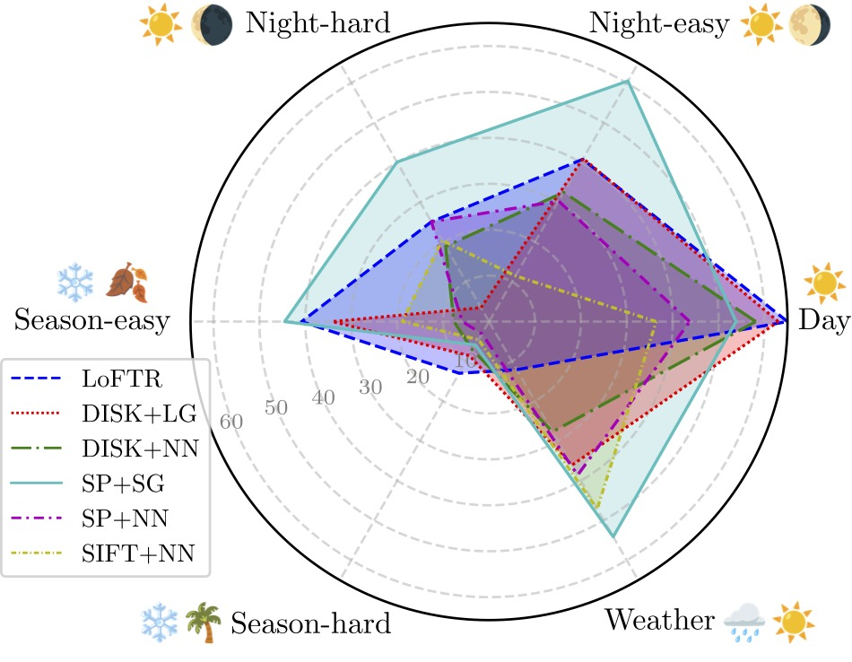
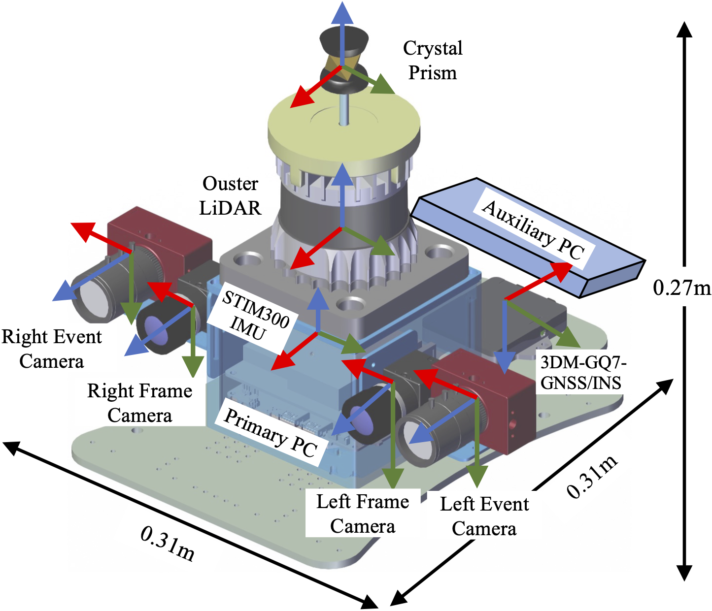

Hi there, I am Jingwen YU (中文名：于靖文), a Ph.D. candidate at [Cheng Kar-Shun Robotics Institute (CKSRI)](https://ri.hkust.edu.hk/), Hong Kong University of Science and Technology (HKUST) and affiliated with [Shenzhen Key Laboratory of Robotics and Computer Vision Lab](https://rcvlab.eee.sustech.edu.cn/) at Southern University of Science and Technology (SUSTech). I am co-supervised by [Prof. Ping TAN](https://ece.hkust.edu.hk/pingtan) and [Chair Prof. Hong ZHANG (SUSTech)](https://eee.sustech.edu.cn/?view=%E5%BC%A0%E5%AE%8F&jsid=18&lang=en). I work closely with [Dr. Jianhao JIAO](https://gogojjh.github.io/), [Dr. Hengli WANG](https://hlwang1124.github.io/), [Mr. Hanjing YE](https://medlartea.github.io/), and [Mr. Chao TANG](https://mkt1412.github.io/). I was with the Intelligent Autonomous Driving Center (IADC) and [RAM-Lab](https://ram-lab.com/), led by Prof. [Ming LIU](https://facultyprofiles.hkust-gz.edu.cn/faculty-personal-page/LIU-Ming/eelium), where I got the chance to work on autonomous vehicles and quadruped robots. Besides, I am also interested in task-oriented grasping, check out the [projects section](/projects/) for more details. I earned my B.Eng. of Information Engineering from Dept. of Electronic and Electrical Engineering under advising from Chair Prof. Hong Zhang and Prof. Yajun Yu.

Now, I teach robots to **locate** themselves in changing environments, focusing on:
- Visual Place Recognition / Loop Closure Detection
- Visual Localization and Image Matching
- Visual SLAM

Reach out if you are interested in my research!

News
======
- *Jul/2024* : 🎉 Jiayi Yang (杨佳怡) and Yongqi Shi (施永祺) graduated from SUSTech and will be going to UTokyo and Duke University. They completed their final-year projects on loop closure verification with me.

- *Jun/2024* : 🎉 A paper "GV-Bench: Benchmarking Local Feature Matching for Geometric Verification of Long-term Loop Closure Detection" is accepted to IROS 2024. [Arxiv](https://arxiv.org/abs/2407.11736), [Code](https://github.com/jarvisyjw/GV-Bench).

- *Apr/2024* : 🎉 Our dataset [FusionPortableV2](https://arxiv.org/abs/2404.08563) is released on arxiv! Check out our [website](https://fusionportable.github.io/dataset/fusionportable_v2/) see how can FPV2 boost your research toward Generalized SLAM.

Selected Publication:
======
Full publication list is available on [google scholar](https://scholar.google.com/citations?user=fu52r0cAAAAJ&hl=zh-CN).
<!-- ## Loop Closure / Place Recognition Verification -->
<html>
  <h3>Verification of Loop Closure Detection / Place Recognition</h3>
    <table style="width:100%;border:0px;border-spacing:0px;border-collapse:separate;margin-right:auto;margin-left:auto;">
          <tr onmouseout="nightsight_stop()" onmouseover="nightsight_start()">
            <td style="padding:20px;width:25%;vertical-align:middle;border-left-style:none;border-bottom-style:none;border-top-style:none;border-right-style:none">
              
            </td>
            <td style="padding:20px;width:75%;vertical-align:middle;border-left-style:none;border-bottom-style:none;border-top-style:none;border-right-style:none">
                <papertitle>GV-Bench: Benchmarking Local Feature Matching for Geometric Verification of Long-term Loop Closure Detection
                </papertitle>
               
                <strong>Jingwen Yu</strong>, Hanjing Ye, Jianhao Jiao, Ping Tan, Hong Zhang
               
              <em>IEEE/RSJ International Conference on Intelligent Robots and Systems, 2024.</em> 
              <!-- <a href="https://ieeexplore.ieee.org/document/10243098">Paper</a> / -->
              
              
              
              
              <!--  -->
              <!--  -->
            </td>
          </tr>
    </table>
  <h3>Multi-Sensor Fusion SLAM</h3>
    <table style="width:100%;border:0px;border-spacing:0px;border-collapse:separate;margin-right:auto;margin-left:auto;">
      <tr onmouseout="nightsight_stop()" onmouseover="nightsight_start()">
        <td style="padding:20px;width:25%;vertical-align:middle;border-left-style:none;border-bottom-style:none;border-top-style:none;border-right-style:none">
          
        </td>
        <td style="padding:20px;width:75%;vertical-align:middle;border-left-style:none;border-bottom-style:none;border-top-style:none;border-right-style:none">
            <papertitle>FusionPortableV2: A Unified Multi-Sensor Dataset for Generalized SLAM Across Diverse Platforms and Scalable Environments
            </papertitle>
           
            Hexiang Wei, Jianhao Jiao, Xiangcheng Hu, <strong>Jingwen Yu</strong>, Xupeng Xie, Jin Wu, Yilong Zhu, Yuxuan Liu, Lujia Wang, Ming Liu
           
          <em>Under Review</em> 
          <!-- <a href="https://ieeexplore.ieee.org/document/10243098">Paper</a> / -->
          
          
          
          
          
        </td>
      </tr>
    </table>
  <h3>Task-Oriented Grasping</h3>
    <table style="width:100%;border:0px;border-spacing:0px;border-collapse:separate;margin-right:auto;margin-left:auto;">
      <tr onmouseout="nightsight_stop()" onmouseover="nightsight_start()">
        <td style="padding:20px;width:25%;vertical-align:middle;border-left-style:none;border-bottom-style:none;border-top-style:none;border-right-style:none">
          
        </td>
        <td style="padding:20px;width:75%;vertical-align:middle;border-left-style:none;border-bottom-style:none;border-top-style:none;border-right-style:none">
            <papertitle>Relationship Oriented Semantic Scene Understanding for Daily Manipulation Tasks
            </papertitle>
           
            Chao Tang, <strong>Jingwen Yu</strong>, Weinan Chen, Bingyi Xia, Hong Zhang
           
          <em>IEEE/RSJ International Conference on Intelligent Robots and Systems, 2022.</em> 
          
          <!--  -->
          <!--  -->
          
          
        </td>
      </tr>
  </table>
</html>

Education
======
- Hong Kong University of Science and Technology, Sep, 2021-present
  - Ph.D. Candidate in Electronic and Computer Engineering

- Southern University of Science and Technology, Sep, 2017- Jun, 2021
  - B.Eng. in Electronic and Electrical Engineering **(with Magna Cum Laude)**
  - **National Scholarship of China**

- National University of Singapore, Jun, 2019 - Aug, 2019
  - Undergraduate Visiting Student

- High School Attached To Shandong Normal University, Sept, 2014 - Jun, 2017

Academic Services
======
- IEEE ICRA 2024 Reviewer
- IEEE/RSJ IROS 2024 Reviewer
- IEEE Intelligent Vehicles Symposium 2022, 2023 Reviewer
- IEEE ICRA 2021 Organizing Committee & Outstanding Volunteer
- MICCAI 2018 Volunteer

Teaching
======
I have always enjoyed teaching since my undergraduate.
- Graduate Teaching Assistant, HKUST
  - ELEC3120 Computer Communication Network
- Undergraduate Teaching Assistant, SUSTech
  - EE346 Mobile Robot Navigation
