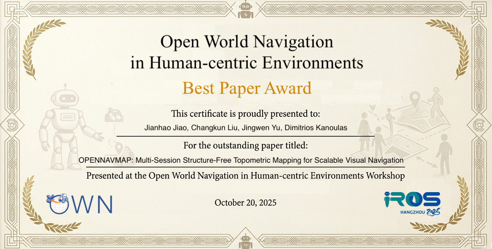
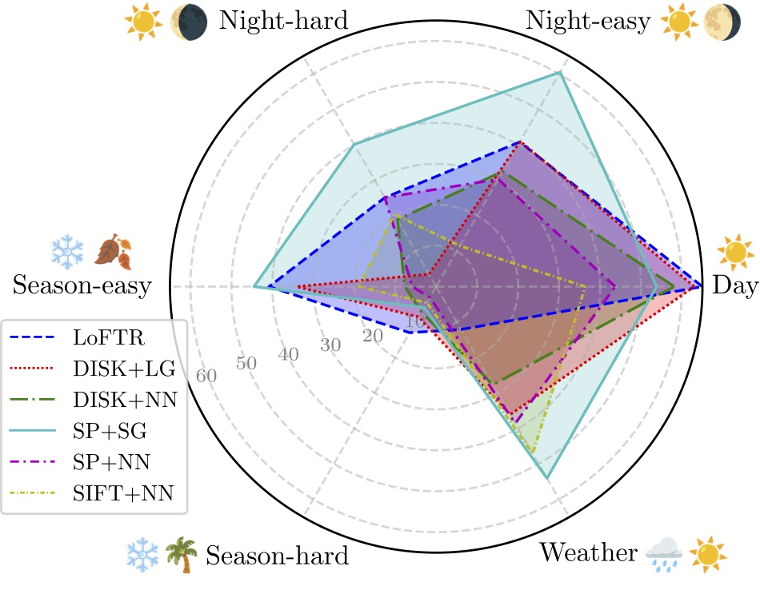
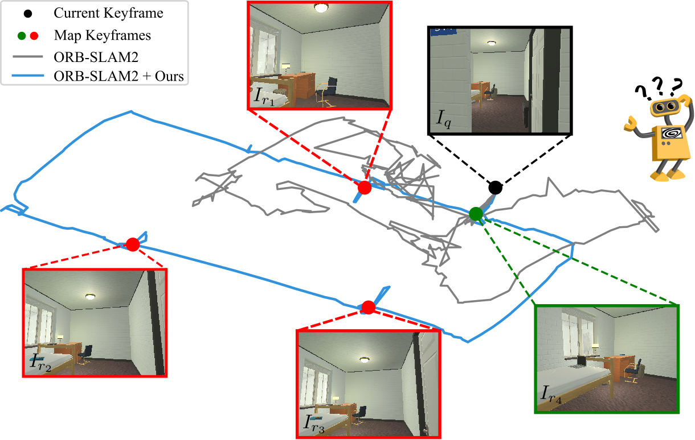
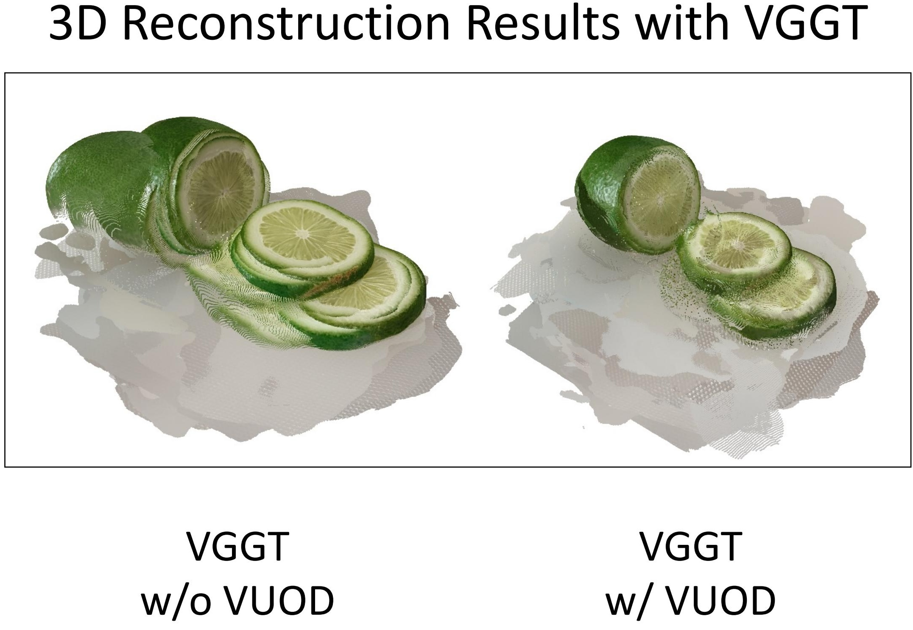
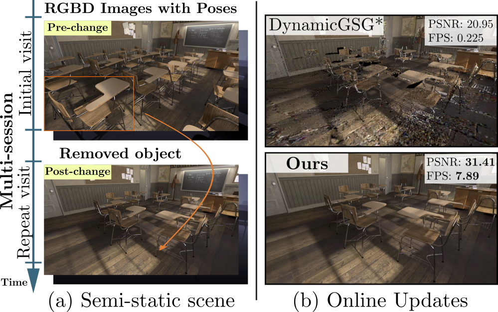
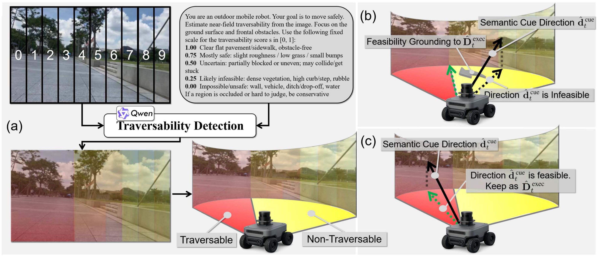
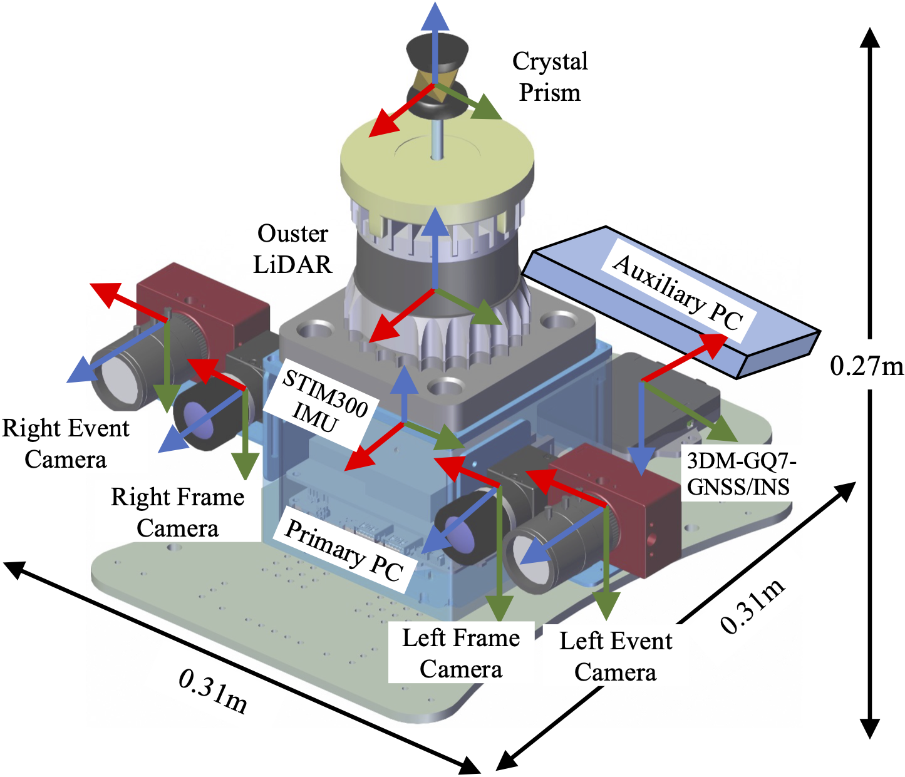
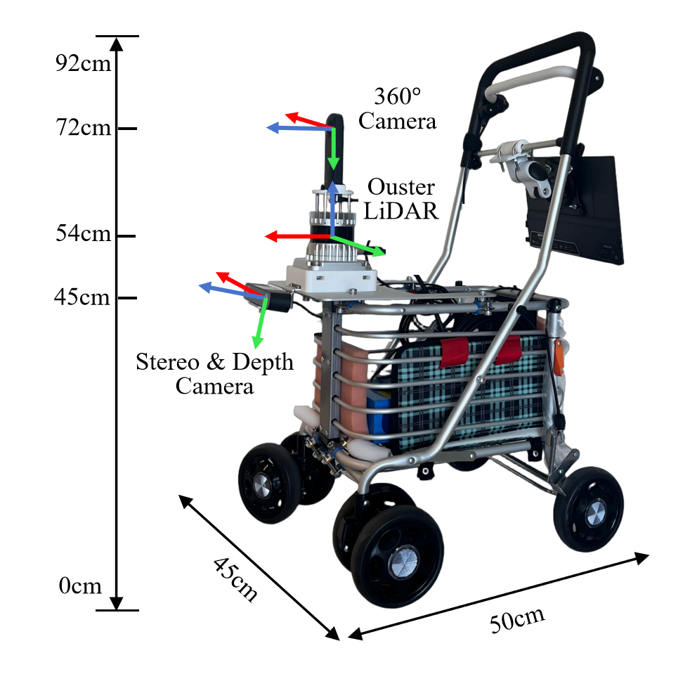

Hi there, I am Jingwen YU (中文名：于靖文), a Ph.D. candidate at [Cheng Kar-Shun Robotics Institute (CKSRI)](https://ri.hkust.edu.hk/), Hong Kong University of Science and Technology (HKUST) and affiliated with [Shenzhen Key Laboratory of Robotics and Computer Vision Lab](https://rcvlab.eee.sustech.edu.cn/) at Southern University of Science and Technology (SUSTech). I am co-supervised by [Prof. Ping TAN](https://ece.hkust.edu.hk/pingtan) and [Chair Prof. Hong ZHANG (SUSTech)](https://faculty.sustech.edu.cn/?tagid=zhangh33&iscss=1&snapid=1&orderby=date&go=2&lang=en). I work closely with [Prof. Jiankun WANG](https://jkwang1992.github.io/), [Dr. Jianhao JIAO](https://gogojjh.github.io/), [Dr. Hengli WANG](https://hlwang1124.github.io/), [Dr. Changkun LIU](https://lck666666.github.io/), [Dr. Zhonghang LIU](https://scholar.google.com/citations?user=I1Waf2QAAAAJ&hl=en&oi=ao), [Dr. Chao TANG](https://mkt1412.github.io/), [Mr. Hanjing YE](https://medlartea.github.io/), and [Miss Lu HUANG](https://scholar.google.com/citations?user=EfOws7UAAAAJ&hl=zh-CN). I was with the Intelligent Autonomous Driving Center (IADC) and [RAM-Lab](https://ram-lab.com/), led by Prof. [Ming LIU](https://facultyprofiles.hkust-gz.edu.cn/faculty-personal-page/LIU-Ming/eelium), where I got the chance to work on autonomous vehicles and quadruped robots. Besides, I am also interested in task-oriented grasping, check out the [projects section](/projects/) for more details. I earned my B.Eng. of Information Engineering from Dept. of Electronic and Electrical Engineering under advising from Chair Prof. Hong Zhang and [Prof. Yajun YU](https://www.eitech.edu.cn/?tid=142&p=teacher).

Now, I teach robots to **locate** themselves in changing environments, focusing on:
- Visual Place Recognition / Loop Closure Detection
- Visual Localization and Image Matching
- Visual SLAM

Reach out if you are interested in my research!

News
======

  <ul style="margin-top: 0; margin-bottom: 0;">

    <li><Strong>Sept/2026</strong>: 🎉🎉🎉 "Cross-Modality Diffusion for Descriptor Manifold Translation in Visible-Infrared Matching" is accepted to RA-L 2026, congrats to Mr. Zeng, Prof. Wu and all the co-authors. </li>
    <li><Strong>Sept/2026</strong>: 🎉🎉🎉 Super excited to share that "Enhancing Glass Surface Reconstruction via Depth Prior for Robot Navigation", on which Jianmin and I are co-first authors, has been nominated for the IROS 2026 Best Paper / Best Student Paper Award session! It is <strong><em>one of only 10 papers selected out of 1,933 (0.52%)</em></strong>.</li>
   <li><Strong>Sept/2026</strong>: 🎉🎉🎉 OpenNavMap is accepted to TRO 2026. Congrats to my Dr. Jianhao Jiao and Dr. Changkun Liu and etc. Check out the <a href="https://rpl-cs-ucl.github.io/OpenNavMap_page/"> Project Page </a> for more details.</li>
  <li><Strong>July/2026</strong>: 🎉🎉🎉 VG-Mapping: Variation-Aware 3D Gaussians for Online Semi-static Scene Mapping, is accepted to RA-L 2026. Congrats to Mr. Yicheng He. Check out the <a href="https://arxiv.org/pdf/2510.09962"> Paper </a> for more details.</li>
  <li><Strong>June/2026</strong>: 🎉🎉🎉 Enhancing Glass Surface Reconstruction via Depth Prior for Robot Navigation, is accepted to IROS 2026. Congrats to my co-first author Miss. Jiamin Zheng. Check out the <a href="https://arxiv.org/pdf/2604.18336"> Paper </a> for more details.</li>
  <li><Strong>June/2026</strong>: 🎉🎉🎉 TARIC: Memory-Augmented Traversability-Aware Outdoor VLN under Interrupted Semantic Cues, is accepted to RAL 2026. Congrats to Mr. Tianle ZENG. Check out the <a href="https://ieeexplore.ieee.org/document/11578332"> Paper </a> for more details.</li>
    <li><Strong>June/2026</strong>: 🎉🎉🎉 VUOD:Versatile Unsupervised Outlier Detection via
Exploiting Intrinsic Separability, is accepted to ECCV 2026. Congrats to Dr. Zhonghang LIU. Check out the <a href="https://zhliu-uod.github.io/VUOD/"> Project Page </a> for more details.</li>
    <li><Strong>April/2026</strong>: 🎉🎉🎉 ROVER is accepted to IEEE Trans. on Automation Science and Engineering, T-ASE. Check out the <a href="https://arxiv.org/pdf/2508.13488"> Paper </a> for more details.</li>
    <li><Strong>April/2026</strong>: 🎉 Start developing a ArXiv daily paper reader, please check out the <em>Daily Paper Reader</em> page on the home page.</li>
    <li><strong>March/2026</strong>: 🎉🎉🎉 TPT-Bench is accepted to IJRR! Check our <a href="https://medlartea.github.io/tpt-bench/"> project page</a> for more details.</li>
    <li><strong>Oct/2025</strong>: 🎉🎉🎉 OpenNavMap won best paper award on <a href="https://adacompnus.github.io/open-world-navigation-25/?utm_source=chatgpt.com">IROS2025 OWN Workshop</a>.</li>
    <li><strong>Sept/2024</strong>: 🎉🎉🎉 <a href="https://arxiv.org/abs/2404.08563">FusionPortableV2</a> is accepted to IJRR!!</li>
    <li><strong>Jul/2024</strong>: 🎉 Jiayi Yang (杨佳怡) and Yongqi Shi (施永祺) graduated from SUSTech and will be going to UTokyo and Duke University. They completed their final-year projects on loop closure verification with me.</li>
    <li><strong>Jun/2024</strong>: 🎉 A paper "GV-Bench: Benchmarking Local Feature Matching for Geometric Verification of Long-term Loop Closure Detection" is accepted to IROS 2024. <a href="https://arxiv.org/abs/2407.11736">Arxiv</a>, <a href="https://github.com/jarvisyjw/GV-Bench">Code</a>.</li>
    <li><strong>Apr/2024</strong>: 🎉 Our dataset <a href="https://arxiv.org/abs/2404.08563">FusionPortableV2</a> is released on arxiv! Check out our <a href="https://fusionportable.github.io/dataset/fusionportable_v2/">website</a> see how can FPV2 boost your research toward Generalized SLAM.</li>
  </ul>

<em>Last update on Sept. 06, 2026.</em>

Awards:
======
<html>
  <table style="width:100%;border:0px;border-spacing:0px;border-collapse:separate;margin-right:auto;margin-left:auto;">
        <tr onmouseout="nightsight_stop()" onmouseover="nightsight_start()">
          <td style="padding:20px;width:25%;vertical-align:middle;border-left-style:none;border-bottom-style:none;border-top-style:none;border-right-style:none">
            
          </td>
          <td style="padding:20px;width:75%;vertical-align:middle;border-left-style:none;border-bottom-style:none;border-top-style:none;border-right-style:none">
              <papertitle><strong>OPENNAVMAP</strong>: Multi-Session Structure-Free Topometric Mapping for Scalable Visual Navigation
              </papertitle>
             
            Jianhao Jiao, Changkun Liu, <strong>Jingwen Yu</strong>, Dimitrios Kanoulas
             
            <em>Open World Navigation in Human-centric Environments (OWN), IEEE/RSJ International Conference on Intelligent Robots and Systems (IROS), 2025.</em> 
            
            
          </td>
        </tr>
  </table>
</html>

Selected Publication:
======
Full publication list is available on [google scholar](https://scholar.google.com/citations?user=fu52r0cAAAAJ&hl=zh-CN).
<html>
  <h3>Verification of Loop Closure Detection / Place Recognition</h3>
    <table style="width:100%;border:0px;border-spacing:0px;border-collapse:separate;margin-right:auto;margin-left:auto;">
          <tr onmouseout="nightsight_stop()" onmouseover="nightsight_start()">
            <td style="padding:20px;width:25%;vertical-align:middle;border-left-style:none;border-bottom-style:none;border-top-style:none;border-right-style:none">
              
            </td>
            <td style="padding:20px;width:75%;vertical-align:middle;border-left-style:none;border-bottom-style:none;border-top-style:none;border-right-style:none">
                <papertitle><strong>GV-Bench</strong>: Benchmarking Local Feature Matching for Geometric Verification of Long-term Loop Closure Detection
                </papertitle>
               
                <strong>Jingwen Yu</strong>, Hanjing Ye, Jianhao Jiao, Ping Tan, and Hong Zhang
               
              <em>IEEE/RSJ International Conference on Intelligent Robots and Systems (IROS), 2024.</em> 
              
              
              
              
              
              
            </td>
          </tr>
    </table>
    <table style="width:100%;border:0px;border-spacing:0px;border-collapse:separate;margin-right:auto;margin-left:auto;">
          <tr onmouseout="nightsight_stop()" onmouseover="nightsight_start()">
            <td style="padding:20px;width:25%;vertical-align:middle;border-left-style:none;border-bottom-style:none;border-top-style:none;border-right-style:none">
              
            </td>
            <td style="padding:20px;width:75%;vertical-align:middle;border-left-style:none;border-bottom-style:none;border-top-style:none;border-right-style:none">
                <papertitle><strong>ROVER</strong>: Robust Loop Closure Verification with Trajectory Prior in Repetitive Environments
                </papertitle>
               
                <strong>Jingwen Yu</strong>, Jiayi Yang, Jianhao Jiao, Anjun Hu, Zhonghang Liu, Jiankun Wang, Ping Tan, and Hong Zhang
               
              <em>IEEE Trans. on Automation Science and Engineering (T-ASE), 2026.</em> 
              
              
              
              
            </td>
          </tr>
    </table>
    <table style="width:100%;border:0px;border-spacing:0px;border-collapse:separate;margin-right:auto;margin-left:auto;">
          <tr onmouseout="nightsight_stop()" onmouseover="nightsight_start()">
            <td style="padding:20px;width:25%;vertical-align:middle;border-left-style:none;border-bottom-style:none;border-top-style:none;border-right-style:none">
              
            </td>
            <td style="padding:20px;width:75%;vertical-align:middle;border-left-style:none;border-bottom-style:none;border-top-style:none;border-right-style:none">
                <papertitle><strong>VUOD</strong>: A Versatile Unsupervised Outlier Detection Framework for Natural, Industrial, Medical Images and Beyond
                </papertitle>
               
                Zhonghang Liu, Siyuan Chen, <strong>Jingwen Yu</strong>, Changshuo Wang, Kunyang Li, Jiangbo Lu
               
              <em>European Conference on Computer Vision (ECCV), 2026.</em> 
              <!--  -->
              
              <!--  -->
            </td>
          </tr>
    </table>
  <h3>Robot Navigation</h3>
  <table style="width:100%;border:0px;border-spacing:0px;border-collapse:separate;margin-right:auto;margin-left:auto;">
      <tr onmouseout="nightsight_stop()" onmouseover="nightsight_start()">
        <td style="padding:20px;width:25%;vertical-align:middle;border-left-style:none;border-bottom-style:none;border-top-style:none;border-right-style:none">
          
        </td>
        <td style="padding:20px;width:75%;vertical-align:middle;border-left-style:none;border-bottom-style:none;border-top-style:none;border-right-style:none">
            <papertitle>Enhancing Glass Surface Reconstruction via Depth Prior for Robot Navigation
            </papertitle>
           
            Jiamin Zheng*, <strong>Jingwen Yu*</strong>, Guangcheng Chen, Hong Zhang
           
            * Equal contribution
           
          <em>IEEE/RSJ International Conference on Intelligent Robots and Systems (IROS), 2026.</em> 
          <em><strong>Best paper finalist 10/1933 (Top 0.52%).</strong></em>           
          
          
        </td>
      </tr>
    </table>
    <table style="width:100%;border:0px;border-spacing:0px;border-collapse:separate;margin-right:auto;margin-left:auto;">
      <tr onmouseout="nightsight_stop()" onmouseover="nightsight_start()">
        <td style="padding:20px;width:25%;vertical-align:middle;border-left-style:none;border-bottom-style:none;border-top-style:none;border-right-style:none">
          
        </td>
        <td style="padding:20px;width:75%;vertical-align:middle;border-left-style:none;border-bottom-style:none;border-top-style:none;border-right-style:none">
            <papertitle><strong>VG-Mapping</strong>: Variation-aware Density Control for Online 3D Gaussian Mapping in Semi-static Scenes
            </papertitle>
           
            Yicheng He, <strong>Jingwen Yu</strong>, Guangcheng Chen, Hong Zhang
           
          <em>IEEE Robotics and Automation Letter (RA-L), 2026.</em> 
          
          
        </td>
      </tr>
    </table>
    <table style="width:100%;border:0px;border-spacing:0px;border-collapse:separate;margin-right:auto;margin-left:auto;">
      <tr onmouseout="nightsight_stop()" onmouseover="nightsight_start()">
        <td style="padding:20px;width:25%;vertical-align:middle;border-left-style:none;border-bottom-style:none;border-top-style:none;border-right-style:none">
          <!--  -->
            
        </td>
        <td style="padding:20px;width:75%;vertical-align:middle;border-left-style:none;border-bottom-style:none;border-top-style:none;border-right-style:none">
            <papertitle>TARIC: Memory-Augmented Traversability-Aware Outdoor VLN Under Interrupted Semantic Cues
            </papertitle>
           
            Tianle Zeng, Hanjing Ye, Jianwei Peng, <strong>Jingwen Yu</strong>, Hanxuan Chen, Hong Zhang
           
          <em>IEEE Robotics and Automation Letter (RA-L), 2026.</em> 
          
        </td>
      </tr>
    </table>

  <h3>Datasets and Benchmarks</h3>
    <table style="width:100%;border:0px;border-spacing:0px;border-collapse:separate;margin-right:auto;margin-left:auto;">
      <tr onmouseout="nightsight_stop()" onmouseover="nightsight_start()">
        <td style="padding:20px;width:25%;vertical-align:middle;border-left-style:none;border-bottom-style:none;border-top-style:none;border-right-style:none">
          
        </td>
        <td style="padding:20px;width:75%;vertical-align:middle;border-left-style:none;border-bottom-style:none;border-top-style:none;border-right-style:none">
            <papertitle><strong>FusionPortableV2</strong>: A Unified Multi-Sensor Dataset for Generalized SLAM Across Diverse Platforms and Scalable Environments
            </papertitle>
           
            Hexiang Wei, Jianhao Jiao, Xiangcheng Hu, <strong>Jingwen Yu</strong>, Xupeng Xie, Jin Wu, Yilong Zhu, Yuxuan Liu, Lujia Wang, Ming Liu
           
          <em>International Journal of Robotics Research (IJRR), 2025</em> 
          
          
          
          
          
        </td>
      </tr>
    </table>
    <table style="width:100%;border:0px;border-spacing:0px;border-collapse:separate;margin-right:auto;margin-left:auto;">
      <tr onmouseout="nightsight_stop()" onmouseover="nightsight_start()">
        <td style="padding:20px;width:25%;vertical-align:middle;border-left-style:none;border-bottom-style:none;border-top-style:none;border-right-style:none">
          
        </td>
        <td style="padding:20px;width:75%;vertical-align:middle;border-left-style:none;border-bottom-style:none;border-top-style:none;border-right-style:none">
            <papertitle><strong>TPT-bench</strong>: A large-scale, long-term and robot-egocentric dataset for benchmarking target person tracking
            </papertitle>
           
           Hanjing Ye, Yu Zhan, Weixi Situ, Guangcheng Chen, <strong> Jingwen Yu</strong>, Ziqi Zhao, Kuanqi Cai, Arash Ajoudani, Hong Zhang
           
          <em>International Journal of Robotics Research (IJRR), 2026 </em> 
          
          
          
          
        </td>
      </tr>
    </table>

  <h3>Task-Oriented Grasping</h3>
    <table style="width:100%;border:0px;border-spacing:0px;border-collapse:separate;margin-right:auto;margin-left:auto;">
      <tr onmouseout="nightsight_stop()" onmouseover="nightsight_start()">
        <td style="padding:20px;width:25%;vertical-align:middle;border-left-style:none;border-bottom-style:none;border-top-style:none;border-right-style:none">
          
        </td>
        <td style="padding:20px;width:75%;vertical-align:middle;border-left-style:none;border-bottom-style:none;border-top-style:none;border-right-style:none">
            <papertitle>Relationship Oriented Semantic Scene Understanding for Daily Manipulation Tasks
            </papertitle>
           
            Chao Tang, <strong>Jingwen Yu</strong>, Weinan Chen, Bingyi Xia, Hong Zhang
           
          <em>IEEE/RSJ International Conference on Intelligent Robots and Systems, 2022.</em> 
          
          
          
        </td>
      </tr>
  </table>
</html>

Education
======
- Hong Kong University of Science and Technology, Sept, 2021-present
  - Ph.D. Candidate in Electronic and Computer Engineering

- Southern University of Science and Technology, Sept, 2017- Jun, 2021
  - B.Eng. in Electronic and Electrical Engineering **(with Magna Cum Laude)**
  - **National Scholarship of China (0.2% Nationwide)**

- National University of Singapore, Jun, 2019 - Aug, 2019 (Visiting Student)
- High School Attached To Shandong Normal University, Sept, 2014 - Jun, 2017

Academic Services
======
- IEEE T-ASE Reviewer
- IEEE RA-L Reviewer
- IEEE/RSJ IROS 2024, 2025, 2026 Reviewer
- IEEE ICRA 2024, 2025 Reviewer
- IEEE Intelligent Vehicles Symposium 2022, 2023 Reviewer
- IEEE ICRA 2021 Organizing Committee & Outstanding Volunteer
- MICCAI 2018 Volunteer

Teaching
======
I have always enjoyed teaching since my undergraduate.
- Guest Lecturer, SUSTech, July, 2025 
  - EE5346 Mobile Robot Navigation
- Graduate Teaching Assistant, HKUST, 2022-2023
  - ELEC3120 Computer Communication Network
- Undergraduate Teaching Assistant, SUSTech, 2020-2021
  - EE346 Mobile Robot Navigation
