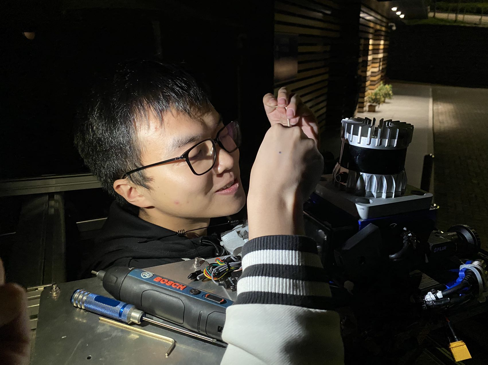
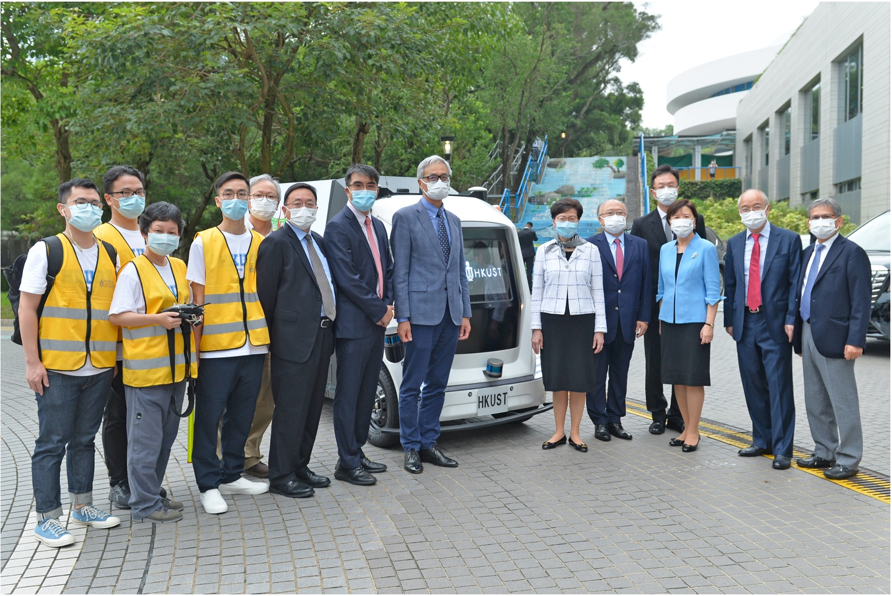


FusionPortable: Building High Precision Dataset for SLAM Across Diverse Platforms and Scalable Environments
======
Sep. 2021 - Present

This project aims to build a high-quality SLAM dataset with a unified and calibrated sensor set across diverse platforms and environments. The dataset can push the development of generalized SLAM across all platforms. This project was initiated in 2021 with consistent efforts from a large group, this project is supported by Prof. Ming LIU and led by Dr. Jianhao JIAO and Mr. Hexiang WEI. I am proud to be part of the FusionPortable Team! 

This huge project has result in two publications so far, which we call FPV1 and FPV2, hoping to build a whole series of research. The details of the dataset please refer to the official [fusionportable website](https://fusionportable.github.io/).

## FusionPortable: A Multi-Sensor Campus-Scene Dataset for Evaluation of Localization and Mapping Accuracy on Diverse Platforms, [IROS 2022](https://ieeexplore.ieee.org/abstract/document/9982119)

<figcaption>Quick overview of all dataset sequences.</figcaption>

## FusionPortableV2: A Unified Multi-Sensor Dataset for Generalized SLAM Across Diverse Platforms and Scalable Environments, [Arxiv Preprint](https://arxiv.org/abs/2404.08563)

<figcaption>Quick overview of all dataset sequences.</figcaption>

The FPV2 focuses on scalable environments comparing to FPV1. We additionally set up a high-speed vehicle platform to collect the data on the street of Hong Kong.

<figcaption>Me (left) and Xupeng XIE (right) on one of the data collection platform. Shot in front of Tower C, HKUST</figcaption>

<figcaption>Hexiang WEI fixing the Fusionportable. Shot in front of Tower B, HKUST</figcaption>

Trials of the Autonomous Logistic Vehicle (Hercules: 夸父)
======
Sep. 2021 – Aug. 2023 (HKUST)

This project aims at deploying an autonomous logistic vehicle (please check [IEEE RAM paper](https://ieeexplore.ieee.org/document/9340284) for more technical details) in HKUST to deliver food and goods between restaurants and offices. My role in this project is to conduct a series of tests on the campus to demonstrate that the autonomous vehicle (Hercules) is safe, reliable, and intelligent. For more details, please refer to official [website](https://kt.hkust.edu.hk/avtrial).

<figcaption>Carrie Lam Cheng Yuet-ngor (former Chief Executive of Hong Kong) visits Hercules in 2021. Shot in front of CYT Building, HKUST. </figcaption>

UGV-Quadrupedal Robot Autonomous Delivery
======
Sep. 2021 – Aug. 2022 (HKUST)

This project aims at deploying a quadrupedal robot for indoor “last mile” delivery in col- laboration with an autonomous logistic vehicle on the HKUST campus. I implemented an indoor LIDAR-inertial localization system on a quadrupedal robot (Unitree A1). Real-world experiments have been conducted in the Cheng Yu Tung Building (CYT) and Robotics Institute (RI) of HKUST.

<figcaption>Live localization and delivery. Shot at 2nd floor of CYT Building, HKUST</figcaption>

